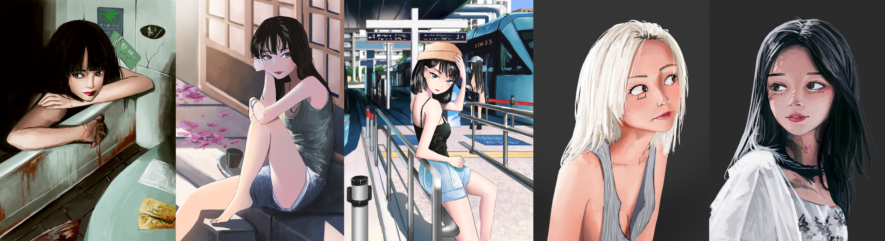

Hi!

I am a student at the University of Toronto.<br>
I'm in the Data Science Specialist Program.

This page will talk about me, and my goals as a data scientist. You can read more about my basic background/experience on the home page!

-----------------------------------------

I am a digital artist, but I am also studying data science, so I am at a weird crossroads where I am working with art AI, while simultaneously making art myself.



I believe there are many insights that can be gained from artists, in the field of image generation. Artists must approach the visual world with structure, in order to capture the most important elements on a canvas. 

I've found little research in this area, and my goal is to solidify my(possibly naive) ideas, continue gaining knowledge of deep learning, and hopefully produce some interesting results!

-------------------------------------

Career-wise, I am looking for experience with computer vision, and computer science research. I am only a third-year student(which I've realized is quite inexperienced in the field of deep learning), so I am looking for an opportunity to develop my existing skills and to learn good industry practices in my field.

```{r setup, include=FALSE}
knitr::opts_chunk$set(echo = FALSE)
```

