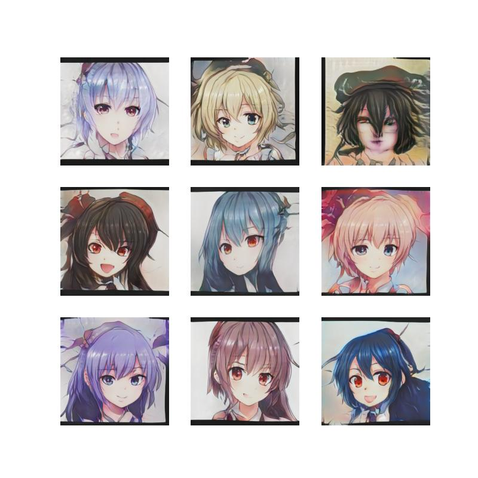

 
## Bio

I'm Kevin Wang!

I study data science at the University of Toronto. My goal is to do cool stuff with neural networks. I am particularly interested in computer vision and image generation. 

I work mostly with convolutional neural networks using Pytorch.

I am trained in "classical" data science, and have knowledge/experience analyzing, visualizing and fitting simple, interpretable models on data using libraries such as pandas, matplotlib and plotly.

I have experience writing reports in R, and understand good industry practices for interpretable and ethical data science investigations.

I am also trained in software development, and have experience with software design, data structures and algorithms, and relational databases.

My goal is to work in deep learning research, and I'm doing my best to make that a reality!

## Experience

**Neobi Technologies** | Jr Data Scientist/Analyst | May 2022-Aug 2022

**U of T ISSC** | Web Scraping and APIs workshop | July 2021

**STEM Fellowship** | Google Analytics Team | September 2019 - October 2020

## Projects

**Few-Shot Image Generation with FastGAN**

(In progress) Exploring methods of synthesizing new images from little reference data.

{width=50%}

**Game AI using supervised imitation learning**

Trained a convolutional neural network to play the popular video game, Temple Run 2. The network imitates human behaviors to achieve high scores.

<iframe width="560" height="315" src="https://www.youtube.com/embed/SW23ZAxpygw" title="YouTube video player" frameborder="0" allow="accelerometer; autoplay; clipboard-write; encrypted-media; gyroscope; picture-in-picture" allowfullscreen></iframe>

  
**Predicting video game outcomes with Random Forests**

Created a classification model that predicts match outcomes of the popular video game, League of Legends, with ~82% testing accuracy.

Data is hand-collected and carefully processed. Writeup can be found [here](https://github.com/dungwoong/league-scrapev2/blob/main/writeup/Riot%20Games%20Writeup.pdf)

## Education

**University of Toronto** | Toronto, ON 
GPA 3.93/4.00

Data Science Specialist | September 2020 - May 2024
