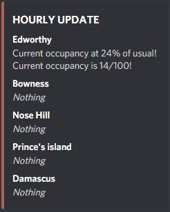

 
## Bio

I'm Kevin Wang!

I study data science at the University of Toronto. I draw and code in my spare time. 

My goal is to have fun, and create real-world impact through programming.

## Experience

**ISSC** | Web Scraping and APIs workshop | July 2021

**STEM Fellowship** | Google Analytics Team | September 2019 - October 2020

## Projects

**League of Legends Prediction Project(In Progress)**
Created a classification model that predicts match outcomes of the popular video game, League of Legends, with ~80% accuracy.

Data is hand-collected and carefully processed.

**Edworthy Web Scraping Project** 

Uses discord and web scraping to notify me when my favorite locations are empty.
Uses BeautifulSoup and discord.py in python.

{width=60%} {width=30%}

## Education

**University of Toronto** | Toronto, ON 
GPA 3.93/4.00

Data Science Specialist | September 2020 - May 2024
