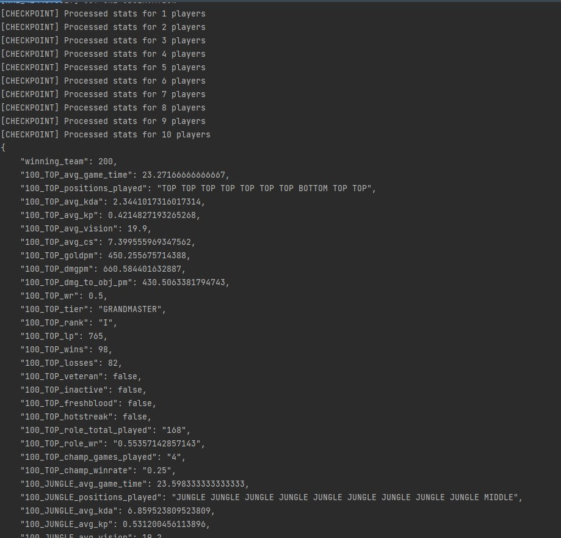

```{r setup, include=FALSE}
knitr::opts_chunk$set(echo = FALSE)
```

# Tensorflow Blog Series
Small tensorflow articles/tutorials on medium.com

Found [here](https://medium.com/@dungwoong)

# League of Legends Web Scraping Project(V2)
Created a classification model to predict match outcomes of the popular game, League of Legends, with ~82% accuracy.

Web scraped the popular site, LeagueOfGraphs.com, and collected data from the official Riot Games API.

Used python libraries such as numpy, pandas, matplotlib and sklearn to process and visualize the data, and to fit a model.

Used a Random Forest Classifier to create a model with 82% Accuracy. More details about exploratory data analysis, visualization and model creation can be found [here](https://github.com/dungwoong/league-scrapev2/blob/main/writeup/Riot%20Games%20Writeup.pdf)



[github repository](https://github.com/5ause/league-scrapev2)

# Course Review System Project
Command line tool that allows users to login, view, comment on and rate courses. Built in Java, this application follows SOLID principles and Clean Architecture, and uses software design patterns to implement many features. This was the final project for my Intro to Software Design class at U of T.


[github repository](https://github.com/CSC207-UofT/course-project-group-010)

# Edworthy web scraping project
A bot that looks at google search results and tells me when parks are empty, so that I can go on walks.<br>
Uses BeautifulSoup and discord.py in python.

{width=60%} {width=30%}

*Google results(left) gets translated to a Bot notification(right)*

[github repository](https://github.com/dungwoong/edworthy)

# House prices linear regression project
Predicting house prices in Ames, Iowa.<br>
This was a data science challenge on Kaggle. Used data cleaning and linear regression techniques to score in the top 15 percent of participants.

[github repository](https://github.com/dungwoong/houseprices-linear-regression)


